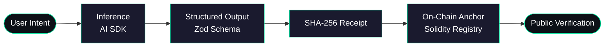

<!--
  ══════════════════════════════════════════════════════════════════
   PROFILE README — rizq imtiaz
   Drop this file at:  github.com/rizqimtiaz/rizqimtiaz/README.md
  ══════════════════════════════════════════════════════════════════
-->

<div align="center">


<a href="https://github.com/rizqimtiaz">
  
</a>

<br/>

<a href="https://github.com/rizqimtiaz"></a>
<a href="https://github.com/rizqimtiaz2"></a>


</div>

---

## `$ whoami`

```ts
const rizq = {
  role:      ["Full-Stack Engineer", "Blockchain Developer", "Data Science Grad"],
  thesis:    "Every AI output deserves a cryptographic receipt.",
  pattern:   "AI generates  →  Zod validates  →  Contract anchors  →  Anyone verifies.",
  signature: "Latin-named protocols. Dark UIs. Audit logs everywhere.",
  status:    "shipping protocols, not products."
} as const;
```

> I sit at the seam between **intelligent data** and **decentralized systems**, building the layer
> that lets AI outputs survive in a world that no longer trusts pixels, prompts, or papers.

---

## The Verifiable-AI Pipeline



This is the spine. Every flagship repo below is the same spine wearing a different coat.

---

## Flagship Protocols

A portfolio of one thesis expressed across seven verticals.

<table>
  <thead>
    <tr>
      <th align="left">Protocol</th>
      <th align="left">Domain</th>
      <th align="left">What it Proves</th>
      <th align="left">Stack</th>
    </tr>
  </thead>
  <tbody>
    <tr>
      <td><a href="https://github.com/rizqimtiaz/sovereigngraph-decentralized-identity"><b>SovereignGraph</b></a></td>
      <td>Identity</td>
      <td>ZK disclosures without revealing data</td>
      <td>Next.js · Zustand · Solidity</td>
    </tr>
    <tr>
      <td><a href="https://github.com/rizqimtiaz/BioChain"><b>BioChain</b></a></td>
      <td>Healthcare</td>
      <td>Clinical-trial data integrity</td>
      <td>TypeScript · Solidity</td>
    </tr>
    <tr>
      <td><a href="https://github.com/rizqimtiaz/EcoOracle"><b>EcoOracle</b></a></td>
      <td>Climate</td>
      <td>Autonomous carbon attestations</td>
      <td>TypeScript · Oracles</td>
    </tr>
    <tr>
      <td><a href="https://github.com/rizqimtiaz/FractalMind"><b>FractalMind</b></a></td>
      <td>Knowledge</td>
      <td>AI-synthesized concept lineage on an infinite canvas</td>
      <td>React Flow · AI SDK · Zod</td>
    </tr>
    <tr>
      <td><a href="https://github.com/rizqimtiaz2/Aegis-Protocol"><b>Aegis-Protocol</b></a></td>
      <td>Media</td>
      <td>Deepfake forensics + perceptual hash on-chain</td>
      <td>Anthropic Vision · Solidity</td>
    </tr>
    <tr>
      <td><a href="https://github.com/rizqimtiaz2/veritas-mesh-platform"><b>Veritas-Mesh</b></a></td>
      <td>Compute</td>
      <td>Proof-of-Inference for a decentralized GPU mesh</td>
      <td>DePIN · L2 · ZK</td>
    </tr>
    <tr>
      <td><a href="https://github.com/rizqimtiaz2/Forge-AI"><b>Forge-AI</b></a></td>
      <td>Creative</td>
      <td>Three labs of schema-validated generative AI</td>
      <td>SAM-2 · ControlNet · GPT-4o</td>
    </tr>
  </tbody>
</table>

---

## Architectural Signature

The same skeleton, hand-tuned per project — by design.

```
┌─ frontend ──────────────────────────────────────────────┐
│  Next.js 14/16  ·  React 19  ·  Tailwind  ·  shadcn/ui  │
│  Zustand (sliced + persisted)  ·  Framer Motion         │
└─────────────────────────────────────────────────────────┘
┌─ ai layer ──────────────────────────────────────────────┐
│  Vercel AI SDK  ·  generateObject + Zod  ·  server-only │
│  deterministic fallbacks → demos run without API keys   │
└─────────────────────────────────────────────────────────┘
┌─ trust layer ───────────────────────────────────────────┐
│  Solidity ^0.8.24  ·  XRegistry.sol  ·  events as audit │
│  Viem / Wagmi  ·  custom errors  ·  pluggable verifier  │
└─────────────────────────────────────────────────────────┘
```

---

## The Stack I Keep Reaching For

**Frontend**  


**AI / Data**  


**Web3**  


**Infra**  


---

## Signal

<div align="center">


<br/>


</div>

---

## `$ connect`

```bash
$ ping rizq

> primary   : github.com/rizqimtiaz
> secondary : github.com/rizqimtiaz2
> mode      : open to collaboration on verifiable AI, ZK, and DePIN
```

<div align="center">

<sub>Built with conviction that the next decade of software will not be written — it will be <b>witnessed</b>.</sub>


</div>
